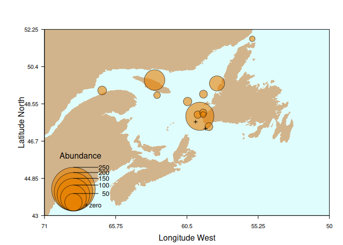
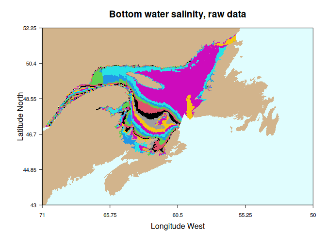
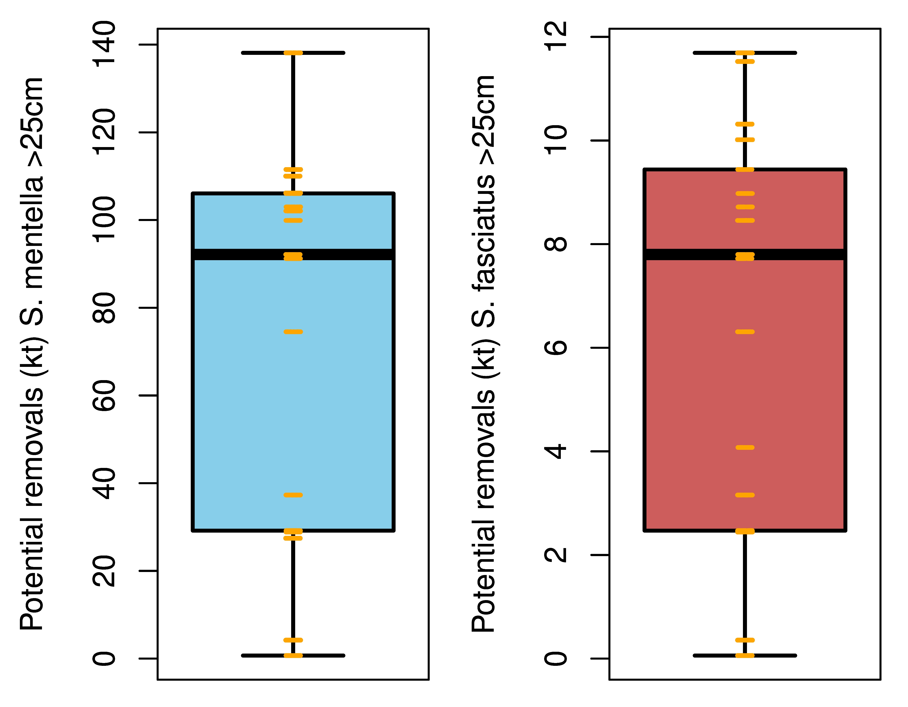

## Co-pilot on github

In about 2021, github began to make available something they called
co-pilot. Co-pilot is an AI that has been trained on open source code
scrapped from github public repositories. What is does is provide
suggestions to developers based on the database of code from these
open-source repositories. Sounds great but it does not do this for free,
it provides this service only to developers with paid subscriptions and
those developers can use the code for closed-source projects.
i.e. microsoft is making money selling open source code for closed
source projects.

I therefore have switched over to gitlab which has a better privacy and
open-source model (including gitlab itself). This may become irrelevant
in the face of LLMs which are effectively doing the same thing (or at
least they have been trained on open data).

Gitlab project however have lower visibility and I am not sure why but
they do not often appear in google searches. Therefore, I have created
this readme on github to provide visibility to my gitlab repositories.

## Gitlab projects

[ecan.map](https://gitlab.com/duplisea/ecan.map) : is an R package that
creates simple maps of eastern Canadian marine waters with various
statistical areas and capability of overlaying survey tracks, etc.
Almost all commands have default arguments so if called without
arguments, they will usually still do something.

[dutil](https://gitlab.com/duplisea/dutil) : is an R package that makes
the benthic habitat descriptors for the Gulf of St. Lawrence easily
available as R data with mapping capacities.

[redfish.u1.advice](https://gitlab.com/duplisea/redfish.u1.advice) : an
R package that calculates fishery removals for Unit 1 (Gulf of
St. Lawrence) redfish that would be considered sustainable based on
various methods. It calculates a quirky quasi-parsimony score to try to
determine the best method given the tradeoff between the desire for
increased process information and the need to make more assumptions by
doing so.

